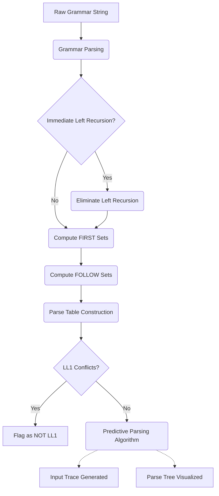

# LL(1) Grammar Debugger & Visual Parser

## Problem Statement

Understanding and debugging Context-Free Grammars (CFGs) for top-down predictive parsing is a complex and error-prone process. Students, educators, and compiler developers often face challenges manually performing the required steps:
- Identifying and eliminating left recursion.
- Accurately computing FIRST and FOLLOW sets for all non-terminals.
- Constructing an LL(1) parse table and spotting multiple-entry conflicts.
- Tracing the stack during predictive parsing to understand exactly where and why a parsing error occurs.
- Visualizing the final parse tree for a given input string.

Without an automated tool, diagnosing whether a grammar is LL(1) and understanding its behavior on specific input strings is tedious and difficult to visualize.

## Solution

The **LL(1) Grammar Debugger & Visual Parser** is a comprehensive, interactive web application built with Python and Streamlit. It solves the above problems by completely automating the parsing pipeline and providing step-by-step visual insights into how a grammar behaves.

### Key Features

1. **Left Recursion Elimination**: Automatically transforms your input grammar to remove immediate left recursion, rendering it more suitable for LL(1) parsing.
2. **FIRST & FOLLOW Sets**: Dynamically computes and clearly tabulates the FIRST and FOLLOW sets for every non-terminal in the transformed grammar.
3. **Parse Table Generation & Conflict Detection**: Automatically builds the LL(1) parsing table. If multiple productions map to the same cell, the tool immediately flags the grammar as **NOT LL(1)** and highlights the conflicting rules.
4. **Interactive Parsing Trace**: Given an input string (e.g., `id + id * id`), the tool performs predictive parsing and displays a detailed step-by-step trace showing the Stack, remaining Input, and the Action taken.
5. **Parse Tree Visualization**: Integrates with Graphviz to render a beautiful, graphical representation of the resulting parse tree if the string is successfully parsed.

### Workflow

The application follows a standard pipeline to analyze and parse inputs:



1. **Grammar Parsing:** The plain-text input representing the CFG is parsed into an internal `Grammar` object, identifying all terminals, non-terminals, productions, and the start symbol.
2. **Grammar Transformation:** The `eliminate_left_recursion` module processes the grammar to safely remove any immediate left recursion, updating the rules as needed.
3. **Set Computation:** The transformed grammar is used by the algorithm to compute FIRST sets recursively, which are then used (along with the augmented rules) to compute FOLLOW sets.
4. **Parse Table Construction:** Using the FIRST and FOLLOW sets, the `generate_parse_table` system populates a 2D parsing table. If any table cell requires more than one production rule, the system explicitly reports an LL(1) conflict.
5. **Predictive Parsing Algorithm:** Given an input string, the continuous `parse` algorithm initializes a stack with the grammar's start symbol and an end marker (`$`). It reads input tokens left-to-right, applying production rules dictated by the parse table until the string is completely accepted or a syntax error is safely encountered.
6. **Abstract Syntax Tree Visualization:** Concurrently during the parsing phase, an Abstract Syntax Tree (AST) node structure is built. If successful, this root node is passed to the Streamlit Graphviz component to display a graphical node-link parse tree diagram.

### Tech Stack
- **Python**: Core logic for grammar parsing, set computation, and AST generation.
- **Streamlit**: For the interactive, responsive user interface.
- **Graphviz**: For rendering the visual parse trees.
- **Pandas**: For clean tabular data display.

### Setup & Installation

1. **Clone or Download the Repository**
2. **Install Python 3.8+** (if not already installed)
3. **Install Dependencies**:
   Navigate to the project directory and run:
   ```bash
   pip install -r requirements.txt
   ```
4. **Install Graphviz**:
   Since the application uses Graphviz to render parse trees, you must optionally install the Graphviz system package if you want the visual trees to render properly:
   - **Windows**: Download the installer from the [Graphviz website](https://graphviz.org/download/) and ensure you add the executable to your system PATH during installation.
   - **macOS**: `brew install graphviz`
   - **Linux (Ubuntu/Debian)**: `sudo apt-get install graphviz`

### Running the Application

To launch the interactive Streamlit interface, run the following command in your terminal from the project root:

```bash
streamlit run app.py
```

This will automatically open the application in your default web browser (usually at `http://localhost:8501`).

### Usage

1. **Input your Grammar**: Enter your CFG rules in the text area (e.g., `E -> E + T | T`).
2. **Provide a Test String**: Enter a space-separated string of tokens to parse (e.g., `id + id * id`).
3. **Run Analysis**: Click the "Run Analysis" button to generate the outputs.
4. **Explore the Tabs**: Navigate through the generated tabs to see the transformed grammar, symbols, sets, parse table, detailed parse trace, and visual parse tree.

### Project Structure
- `app.py`: Streamlit frontend orchestration.
- `grammar_core.py`: Core logic for representing the grammar, terminals, and non-terminals.
- `transform.py`: Functions applied for grammar transformations (like left recursion elimination).
- `first_follow.py`: Logic to recursively compute FIRST and FOLLOW sets.
- `parse_table.py`: Generates the predictive parse table and detects conflicts.
- `parser_ll1.py`: Contains the LL(1) parsing algorithm (stack, input pointer) and generates the parse trace.
- `visualize.py`: Constructs the `.dot` format string for Graphviz tree rendering.
